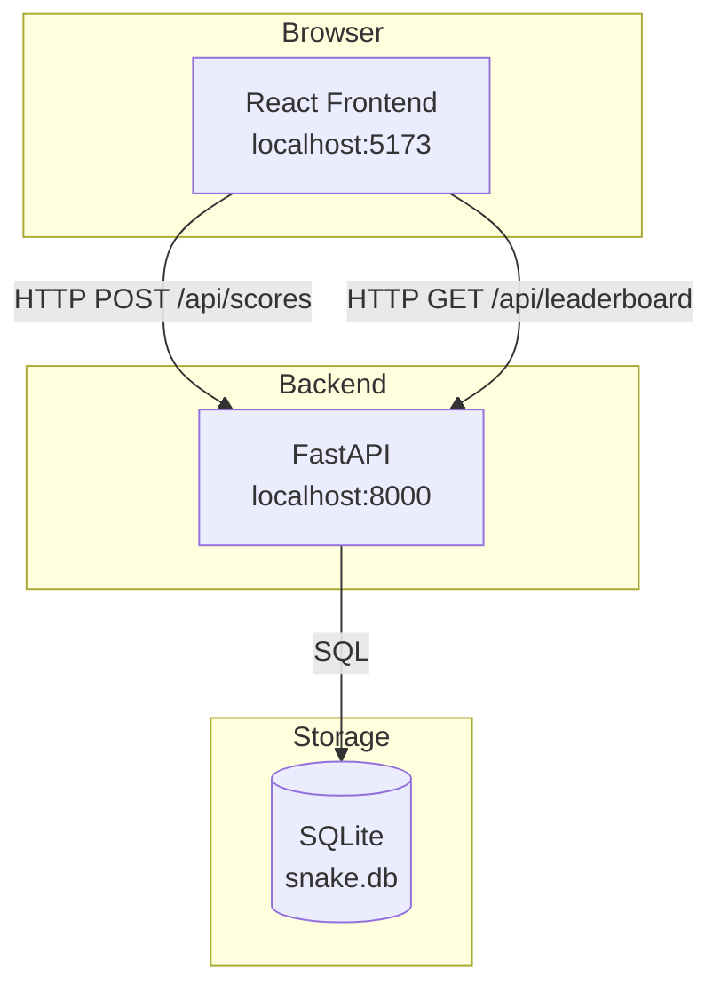
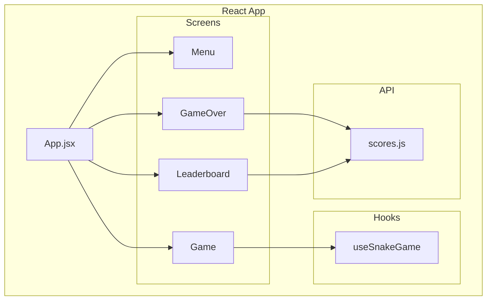
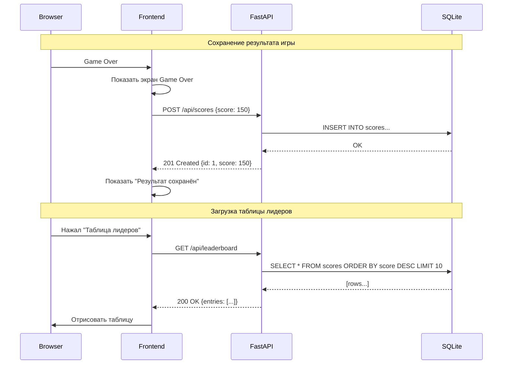
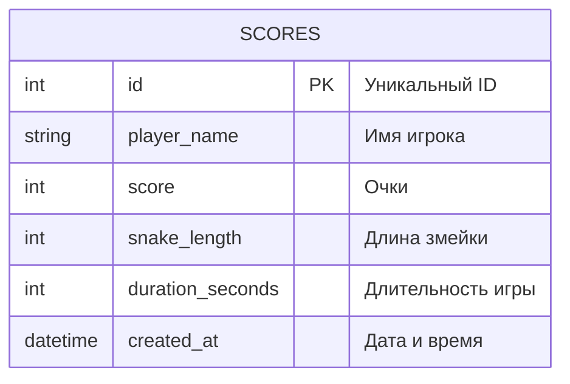
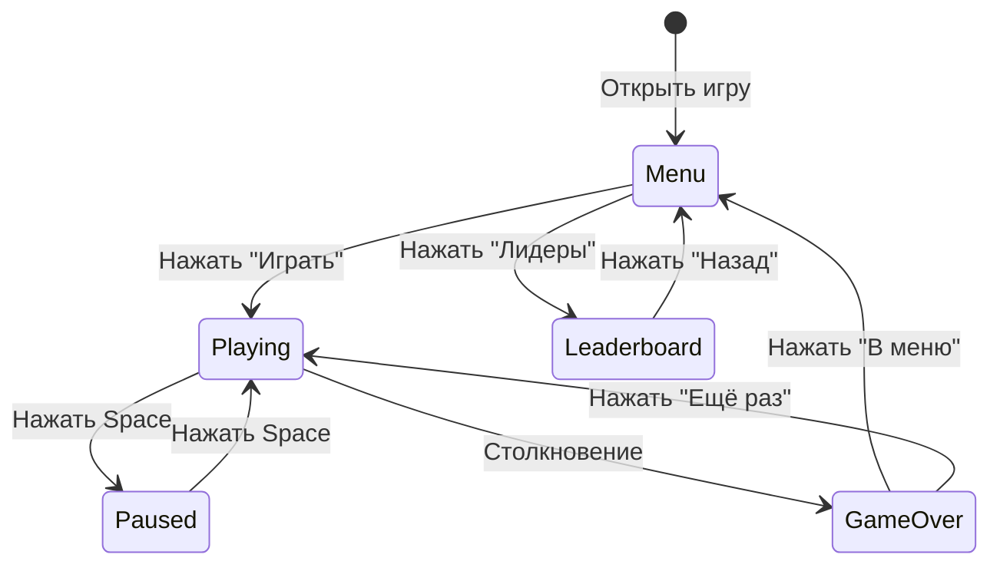
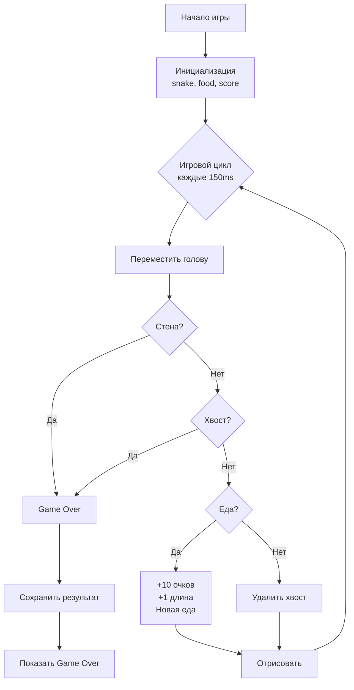
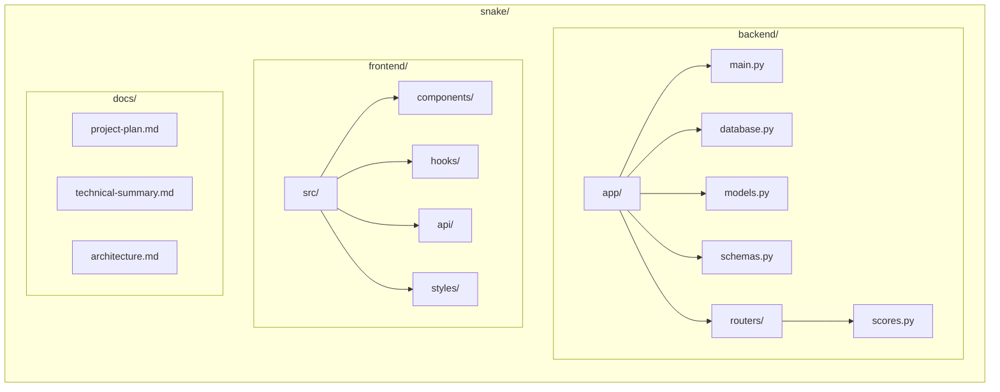

# 🏗️ Архитектура проекта: Snake Game

> Диаграммы в формате Mermaid

---

## Общая схема системы

---

## Схема компонентов Frontend

---

## Схема обработки запроса

---

## Схема базы данных

---

## Состояния игры

---

## Игровой цикл

---

## Структура файлов

